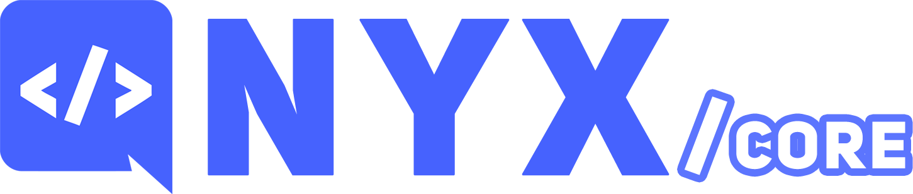

---

`@nyx-discord/core` holds the types/interfaces that define the objects and relations between all of nyx's components.

## 📚 Introduction

This package contains the types and interfaces that declare the contracts between all of nyx's components.

`@nyx-discord/framework` depends only on these interfaces, and not actual implementations, reducing coupling and
allowing
developers to code their own implementations from scratch of every nyx object and plug it without issues.

You can also install this package as a `devDependency` and use it to develop nyx plugins, without needing to rely on any
specific nyx implementation, such as `@nyx-discord/framework`.

## 📖 Documentation

nyx has two documentation sources:

* [Typedoc](https://nyx-discord.github.io/nyx/typedoc), documenting classes, types and interfaces, so you can easily
  explore
  the library through your browser.
* [Docusaurus](https://nyx-discord.github.io/nyx/docs), which serves as a guide for how to use and modify the framework.

